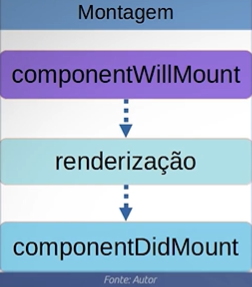
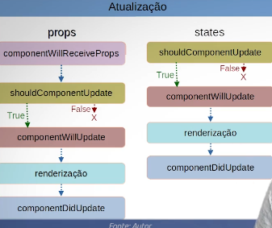
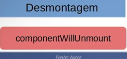

# Ciclo de Vida de Um Componente 

### Fases:

- **Inicialização**: Fase inicial de um componente React. Criado em uma classe e o construtor o inicializa. 

- **Montagem**: Fase em que a instância do componente já está criada e é inserida no DOM, renderizando em uma página Web.

Lembre-se de um método comumente utilizado nessa fase:

- `componentDidMount()`: Chamado após o componente ser inserido no DOM.

- **Atualização**: É responsável por lidar com a interação com o usuário

Lembre-se de um método comumente utilizado nessa fase:

- `componentDidUpdate()` Chamado imediatamente após a atualização.

- **Desmontagem**: Fase em que o componente é removido do DOM.

Lembre-se de um método comumente utilizado nessa fase:

- `componentWillUnmount()`: Chamado imediatamente antes do componente ser removido do DOM.

Observação: Alguns métodos citados nas imagens deixaram de ser válidos nas versões mais recentes do React.

 ---

> "Explore o ciclo de vida dos componentes React e eleve suas aplicações a um novo patamar de eficiência e performance." 

 

